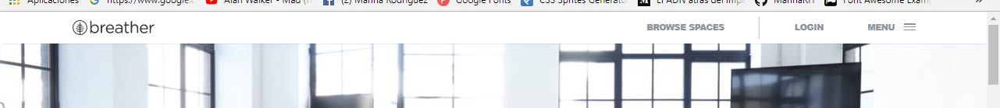
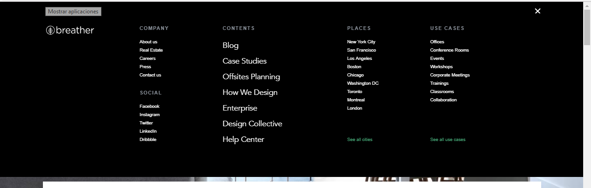
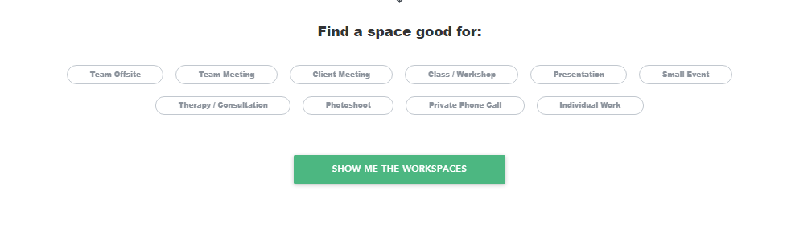
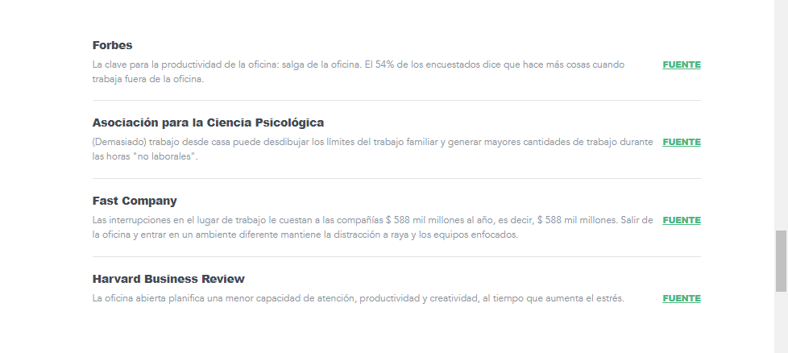
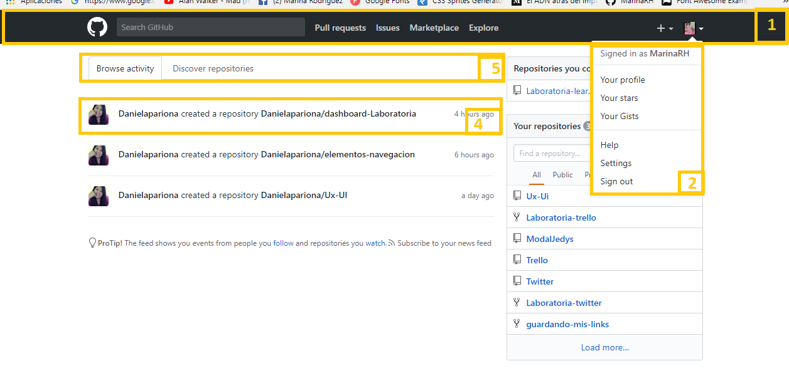
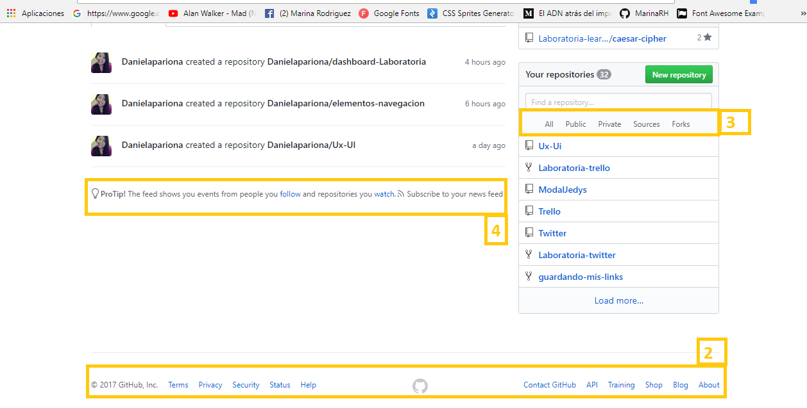
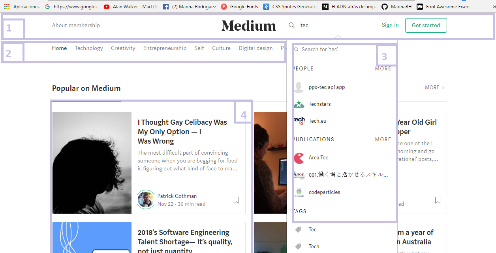
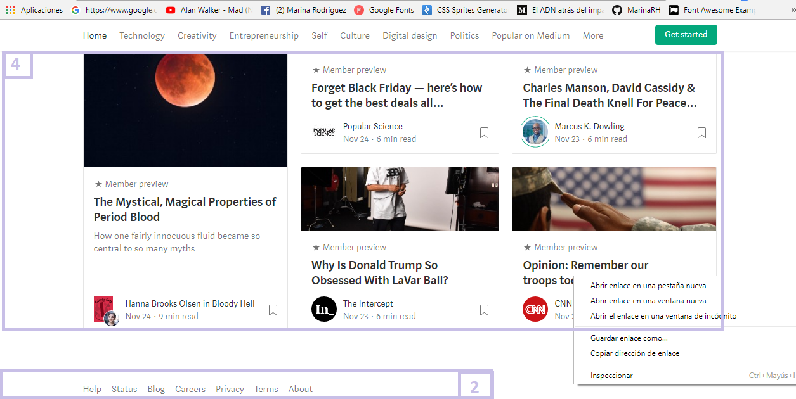
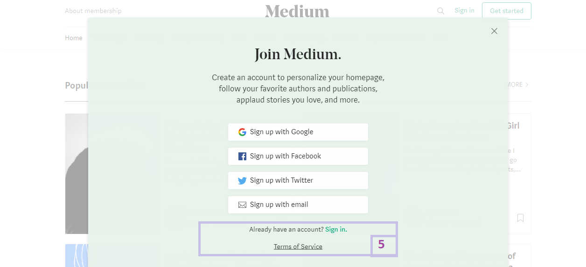

# CONOCE LOS ELEMENTOS DE NAVEGACION

---
## Objetivo

En este reto conoceremos los principales tipos de **navegaciones** que encontraremos en las paginas:

+ NAVEGACION GLOBAL 
+ NAVEGACION LOCAL
+ NAVEGACION FILTRADA
+ NAVEGACION FACETADA
+ NAVEGACION CONTEXTUAL
+ NAVEGACION INLINE

## BREATHER

* NAVEGACION GLOBAL

* NAVEGACION LOCAL

* NAVEGACION FACETADA

* NAVEGACION INLINE

* NAVEGACION CONTEXTUAL

---

## GIT HUB

* 1 => N. GLOBAL
* 2 => N. LOCAL
* 3 => N. FACETADA
* 4 => N. INLINE
* 5 => N. CONTEXTUAL

---

## Medium

* 1 => N. GLOBAL
* 2 => N. LOCAL
* 3 => N. FILTRADA
* 4 => N. CONTEXTUAL
* 5 => N. INLINE

**MarinaRh**

